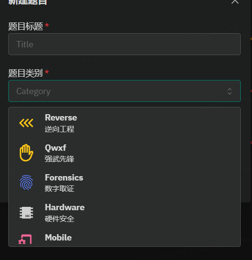

# GZCTF-Simple-Development
reference:http://zp9080.github.io/post/%E7%AC%94%E8%AE%B0/gzctf%E5%B9%B3%E5%8F%B0%E6%90%AD%E5%BB%BA%E8%BF%90%E7%BB%B4/

1. docker build -t gzctf . in src folder
2. obtain gzctf.tar by docker save 
3. load the image by docker load

Most importantly,you should modify docker-compose.yml, then restart with docker-compose up -d

For more details, see the reference blog

The src folder is the src folder of the project https://github.com/GZTimeWalker/GZCTF

In this project, the blockchain module is replaced with qwxf. Here, qwxf is not added but replaced. However, adding a qwxf module should not be difficult, but the author did this to save time and reduce trouble, because our CTF school competition does not have blockchain questions.

The final effect is shown in the figure below
